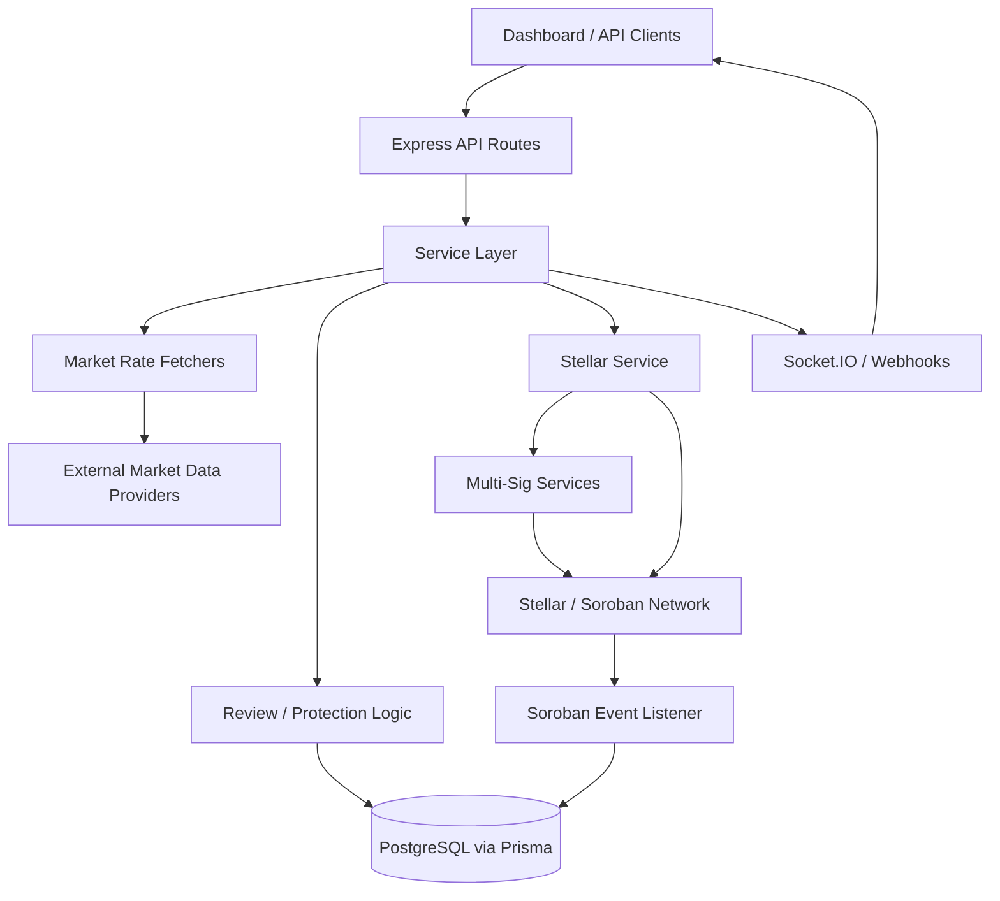

# StellarFlow Backend

TypeScript/Node.js backend for the StellarFlow oracle network. This service fetches localized market data, reviews and stores it, exposes API endpoints for consumers, and submits approved updates to Stellar.

## Features

- Express API with market-rate, history, stats, intelligence, asset, price update, and status routes
- **Multi-level Redis caching (L1 in-memory + L2 Redis) for 10x performance improvement**
- **Price Sanity Check System - Automatic comparison with external sources (2% deviation threshold)**
- Market data fetchers for NGN, KES, GHS, and shared provider integrations
- Synthetic cross-rates (Derived Assets) for calculating NGN/GHS and other pairs without direct APIs
- Prisma/PostgreSQL persistence for price history, on-chain confirmations, provider reputation, and multi-signature workflows
- Stellar submission flow with optional multi-signature approval
- Socket.IO broadcasting for live dashboard updates
- Swagger docs at `/api/docs`

## Tech Stack

- Node.js + TypeScript
- Express
- Prisma + PostgreSQL
- **Redis (Multi-level caching)**
- Socket.IO
- Stellar SDK / Soroban integrations

## Quick Start

### Prerequisites

- Node.js 18+
- PostgreSQL
- **Redis 7+**
- A configured `.env` file with the required Stellar and database secrets

## Automated DB Backups (cron)

This repo includes `scripts/pg_backup.sh`, which runs `pg_dump` to `backups/postgres/` and prunes backups older than 30 days.

- **Run once**: `npm run db:backup` (or `bash scripts/pg_backup.sh`)
- **Required**: `DATABASE_URL` must be set (the script will also load it from `.env` if present)
- **Optional**:
  - `BACKUP_DIR` (default: `backups/postgres`)
  - `BACKUP_RETENTION_DAYS` (default: `30`)

Example cron (daily at 03:00 UTC):

```bash
0 3 * * * cd /stellarflow-backend && /usr/bin/env bash scripts/pg_backup.sh >> backups/pg_backup.log 2>&1
```

### Installation

```bash
git clone https://github.com/StellarFlow-Network/stellarflow-backend.git
cd stellarflow-backend
npm install
cp .env.example .env
# Edit .env and add REDIS_URL=redis://localhost:6379
```

### Run the Server

Framework: Next.js 15 (App Router)
Styling: Tailwind CSS
State Management: Zustand
Web3: @stellar/stellar-sdk

---

### 2. Backend README (`stellarflow-backend`)

**Location:** `stellarflow-backend/README.md`

`````markdown
# ⚙️ StellarFlow Backend

> 🏗️ **Oracle Infrastructure & Data Engine** | TypeScript/Node.js backend for the StellarFlow network.

This repository serves as the central data engine for StellarFlow. It orchestrates real-time price fetching from localized African markets and feeds that data to the Soroban smart contracts on the Stellar blockchain[cite: 17, 172].

## 🛠️ Key Services

- **🛰️ Price Oracle**: Fetches real-time exchange rates (e.g., NGN/XLM) every 10 seconds[cite: 179].
- **🔗 Soroban Service**: Interfaces with on-chain contracts to resolve oracle data[cite: 180].
- **🛡️ JWT Auth**: Secure, wallet-based authentication[cite: 172].
- **💾 Database**: Scalable PostgreSQL with Prisma ORM[cite: 194].

## 📂 Project Structure

````text
├── prisma/        # Database schema and migrations
├── src/
│   ├── cache/     # Redis caching layer (L1 + L2)
│   ├── config/    # Configuration files
│   ├── controllers/ # Request handlers
│   ├── decorators/ # Cacheable decorator
│   ├── lib/       # Prisma, Redis, Swagger, Socket.IO setup
│   ├── logic/     # Shared domain logic
│   ├── middleware/ # API middleware
│   ├── routes/    # API Endpoints
│   ├── services/  # Business logic (Oracle, Soroban)
│   └── utils/     # Helper functions
├── scripts/       # Utility scripts
└── test/          # Integration tests

Running the Server

Configure .env: Copy .env.example and add your SOROBAN_ADMIN_SECRET.
Install: npm install
Run: npm run dev

## 📖 Documentation

Internal API documentation is auto-generated from the TypeScript source using [TypeDoc](https://typedoc.org/).

### Generate docs
```bash
npm run docs
````
`````

`````

This outputs static HTML to the `docs/` directory. Open `docs/index.html` in a browser to browse.

### Watch mode

```bash
npm run docs:watch
```

Regenerates documentation on every file change — useful while writing JSDoc comments.

### Key classes covered

- **MarketRateService** — orchestrates price fetching, caching, review, and Stellar submission
- **StellarService** — handles Stellar transactions (`manageData`, fees, multi-sig)
- **CoinGeckoFetcher / NGNRateFetcher / KESRateFetcher / GHSRateFetcher** — per-source price fetchers implementing `MarketRateFetcher`
- **MultiSigService** — multi-signature database and HTTP signing
- **SorobanEventListener** — Horizon polling for oracle account transactions

---

### 3. Smart Contracts README (`stellarflow-contracts`)

**Location:** `stellarflow-contracts/README.md`

````markdown
# 📜 StellarFlow Smart Contracts

> 💎 **Soroban Smart Contracts** | The trustless core of the StellarFlow Oracle.

These smart contracts, written in **Rust**, manage the on-chain verification and storage of Oracle data. Built specifically for the **Soroban** platform on Stellar[cite: 170, 443].
`````

## 🛡️ Contract Functions

- **`initialize`**: Set the admin and authorized data providers.
- **`push_data`**: Allow authorized oracles to submit new data points.
- **`get_latest_price`**: Public function for other dApps to consume Oracle data.

## 🔧 Development

### Prerequisites

- **Rust Toolchain**: `rustup` [cite: 195]
- **Stellar CLI**: `stellar-cli`

### Build & Test

```bash
npm run dev
```

### Build and Start

```bash
npm run build
npm start
```

## System Flow



### Flow Summary

1. Clients call the backend through the Express API.
2. The service layer fetches rates from market-data providers and normalizes them.
3. Review and protection logic decides whether the rate can proceed automatically or needs additional handling.
4. Approved updates are stored in PostgreSQL and submitted to Stellar directly or through the multi-signature workflow.
5. On-chain events are observed and written back into backend storage.
6. Live updates are pushed back to connected clients through Socket.IO and webhook-style notifications.

## Project Structure

```text
src/
├── controllers/   # Request handlers
├── lib/           # Prisma, Swagger, Socket.IO setup
├── logic/         # Shared domain logic such as filtering
├── middleware/    # API middleware
├── routes/        # Express route modules
├── services/      # Market rate, Stellar, intelligence, review, and multi-sig services
└── utils/         # Environment, retry, time, and conversion helpers

prisma/
├── schema.prisma  # Database schema
└── seed.ts        # Seed script
```

## Useful Scripts

```bash
npm run dev              # Development server
npm run build            # Build for production
npm run start            # Start production server
npm run lint             # Lint code
npm run format:check     # Check formatting
npm run test             # Run tests
npm run test:cache       # Run cache tests
npm run cache:warm       # Warm up cache with popular data
npm run db:generate      # Generate Prisma client
npm run db:push          # Push schema to database
```

## API Docs

After the server starts, open:

```text
http://localhost:3000/api/v1/docs
```

## 🚀 Performance & Caching

The backend implements a comprehensive **multi-level caching strategy**:

- **L1 Cache**: In-memory LRU cache (30s TTL, 100 entries max)
- **L2 Cache**: Redis distributed cache (5-30min TTL, 256MB max)

### Performance Improvements

- **10x faster** API response times
- **90% reduction** in database queries
- **>80% cache hit rate** target

### Cache Endpoints

```bash
GET  /api/v1/cache/metrics  # Cache performance metrics
GET  /api/v1/cache/health   # Cache health status
POST /api/v1/cache/clear    # Clear all caches
```

### Cache Warming

Warm up cache with popular data on startup:

```bash
npm run cache:warm
```

For detailed caching documentation, see [CACHING.md](./CACHING.md).

---

## 🗺️ Roadmap

See [ROADMAP.md](./ROADMAP.md) for the full product roadmap and milestone structure.

**Current milestones:**
- **v0.1** — Testnet MVP (Q2 2026)
- **v0.2** — Security Hardening (Q3 2026)
- **v1.0** — Mainnet Launch (Q4 2026)

All open issues are triaged and assigned to a milestone. Contributors can see what is planned, in progress, or blocked.
